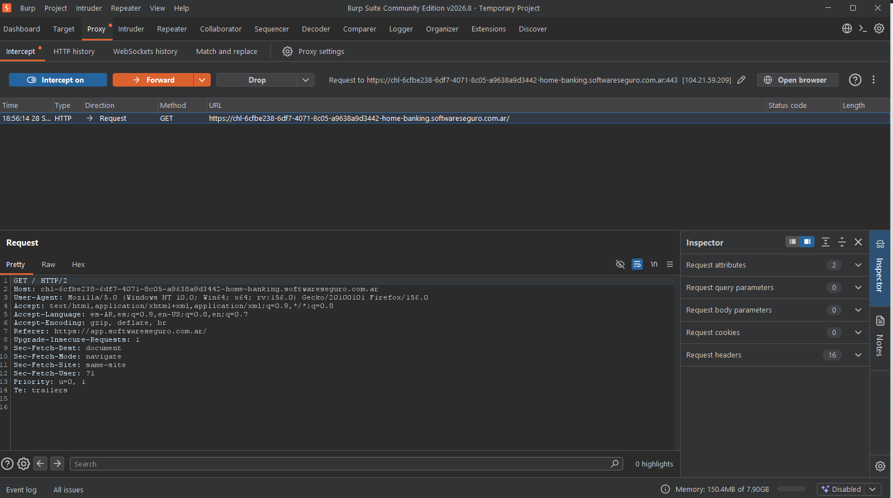

1. Abrir Burp Suite
2. Activar extensión en Firefox de Foxy Proxy
3. Abrir el laboratorio de Software Seguro:
 https://chl-6cfbe238-6df7-4071-8c05-a9638a9d3442-home-banking.softwareseguro.com.ar/
4. Activar el interceptor en Burp Suite

5. En el endpointGET / HTTP/2
Host:chl-6cfbe238-6df7-4071-8c05-a9638a9d3442-home-banking.softwareseguro.com.ar
Se detiene el tráfico al servidor
